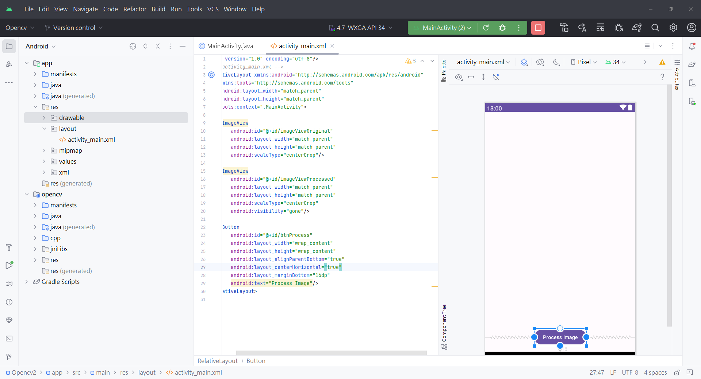
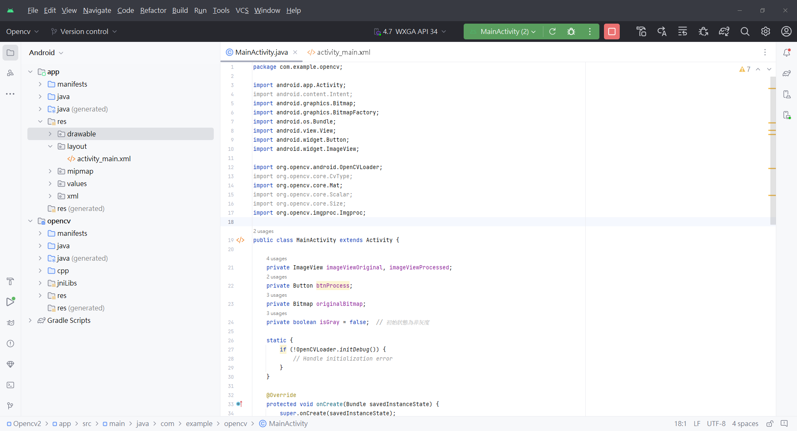
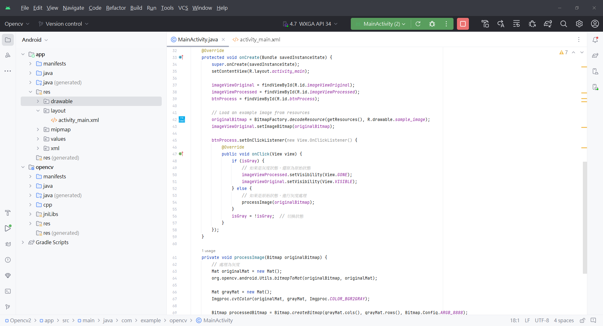
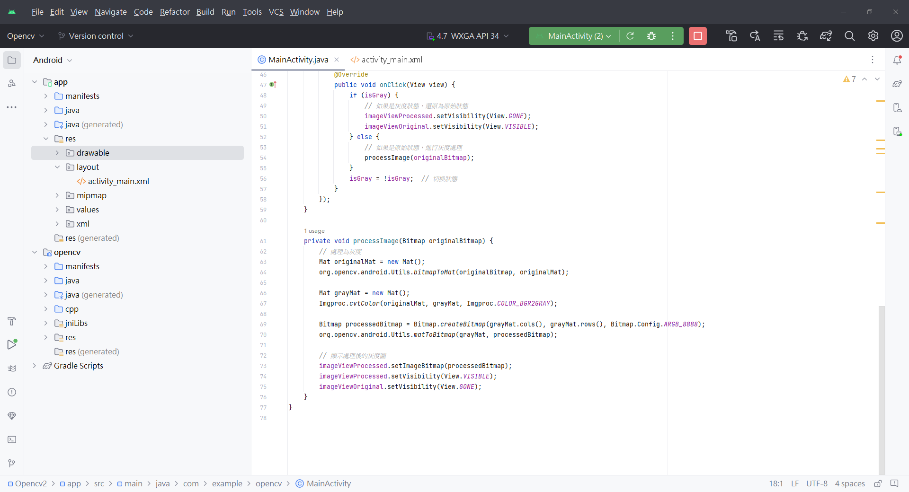
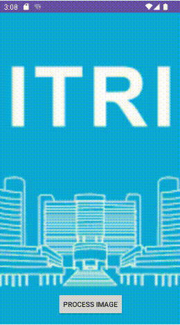

# 探索影像處理世界：在Android Studio中應用OpenCV實現簡單的灰度處理

在現代移動應用程式開發中，影像處理已成為一個引人注目的領域，為我們的應用帶來更豐富的功能和視覺效果。在這個過程中，OpenCV（Open Source Computer Vision Library）已經成為一個強大的工具，提供豐富的影像處理功能。在這篇文章中，我們將深入探討如何在Android Studio環境中整合OpenCV，並建立一個簡單而有效的影像處理應用。我們的目標是透過實際操作，讓你快速上手，理解如何讀取照片並進行基本的灰度處理。

## 打通開發之門

在開始之前，確保你已經成功配置了Android Studio並整合了OpenCV庫。這是實現影像處理魔法的第一步。接下來，我們將引導你進入應用程式開發的精彩世界，展示如何透過Android Studio，利用OpenCV的威力，實現一個簡單而實用的灰度處理功能。

讓我們一同啟動這趟探險，將你的Android應用程式帶入全新的視覺體驗！

### 步驟1: 環境設定
首先，確保你已經在Android Studio中配置好OpenCV。可以提及如何在專案中引入OpenCV庫文件，以及確保在gradle文件中添加了正確的依賴。

```gradle
    implementation 'org.opencv.android:opencv-android:4.8.0'
```

### 步驟2：設計介面

建立一個包含`ImageView`的介面，用於顯示原始照片和處理後的結果。你可以使用XML文件定義介面佈局，並在`Activity`中進行設置。


這是一個包含兩個 `ImageView` 和一個 `Button` 的 XML 布局檔案，通常被稱為 `activity_main.xml`。

將以下功能設置在activity_main.xml文件當中

#### RelativeLayout

```
    <RelativeLayout xmlns:android="http://schemas.android.com/apk/res/android"
        xmlns:tools="http://schemas.android.com/tools"
        android:layout_width="match_parent"
        android:layout_height="match_parent"
        tools:context=".MainActivity">
```

- `RelativeLayout` 是一種布局，它允許子視圖相對於父視圖或其他子視圖進行定位。在這裡，它被用來包含所有的元素。

#### ImageView - imageViewOriginal

```
    <ImageView
        android:id="@+id/imageViewOriginal"
        android:layout_width="match_parent"
        android:layout_height="match_parent"
        android:scaleType="centerCrop"/>
```

- `ImageView` 是用來顯示圖片的元素。這裡的 `imageViewOriginal` 是顯示原始圖片的`ImageView`，它的寬度和高度被設定為 `match_parent`，使其填滿整個父視圖。`scaleType="centerCrop"` 會將圖片等比例縮放，確保圖片填滿 ImageView 並保持圖片的中

#### ImageView - imageViewProcessed

```
    <ImageView
        android:id="@+id/imageViewProcessed"
        android:layout_width="match_parent"
        android:layout_height="match_parent"
        android:scaleType="centerCrop"
        android:visibility="gone"/>
```
- 另一個 `ImageView`，這裡的 `imageViewProcessed` 是用來顯示經過處理的圖片，初始時它的 `visibility` 被設為 `gone`，表示一開始它是不可見的。同樣，它的寬度和高度也被設為 `match_parent`。

#### Button - btnProcess

```
    <Button
        android:id="@+id/btnProcess"
        android:layout_width="wrap_content"
        android:layout_height="wrap_content"
        android:layout_alignParentBottom="true"
        android:layout_centerHorizontal="true"
        android:layout_marginBottom="16dp"
        android:text="Process Image"/>
```

- `Button` 元素，這個按鈕的 ID 是 `btnProcess`。它的 `layout_width` 和 `layout_height` 設置為 `wrap_content`，使得按鈕的大小根據內容而定。`layout_alignParentBottom="true"` 和 `layout_centerHorizontal="true"` 分別將按鈕置於父視圖的底部中央。`layout_marginBottom` 設置為 16dp，在按鈕底部添加了一個外邊距。按鈕上的文字是 `"Process Image"`。




### 步驟3：程式邏輯

在MainActivity.java中，編寫程式邏輯來處理照片。在這個例子中，我們將使用OpenCV將照片轉換為灰度圖。

#### Package 與 Import Statements

```
    package com.example.opencv;

    import android.app.Activity;
    import android.content.Intent;
    import android.graphics.Bitmap;
    import android.graphics.BitmapFactory;
    import android.os.Bundle;
    import android.view.View;
    import android.widget.Button;
    import android.widget.ImageView;

    import org.opencv.android.OpenCVLoader;
    import org.opencv.core.CvType;
    import org.opencv.core.Mat;
    import org.opencv.core.Scalar;
    import org.opencv.core.Size;
    import org.opencv.imgproc.Imgproc;
    
```
- `package com.example.opencv;`: 宣告此檔案所屬的包名。
- `import`語句: 引入所需的Android和OpenCV類別。

#### Activity Class 宣告
```
public class MainActivity extends Activity {

    private ImageView imageViewOriginal, imageViewProcessed;
    private Button btnProcess;
    private Bitmap originalBitmap;
    private boolean isGray = false;  // 初始狀態為非灰度
    
    //靜態區塊（Static Block）初始化OpenCV
    
    static {
        if (!OpenCVLoader.initDebug()) {
            // Handle initialization error
        }
    }
```

- `MainActivity`類別宣告，這是Android應用程式的主活動。
- 靜態區塊，在類別被加載時執行。這裡使用`OpenCVLoader.initDebug()`初始化OpenCV庫。如果初始化失敗，可以在`// Handle initialization error`處處理錯誤。

#### `onCreate` 方法

```
    @Override
    protected void onCreate(Bundle savedInstanceState) {
        super.onCreate(savedInstanceState);
        setContentView(R.layout.activity_main);
        
        //控制項宣告
        imageViewOriginal = findViewById(R.id.imageViewOriginal);
        imageViewProcessed = findViewById(R.id.imageViewProcessed);
        btnProcess = findViewById(R.id.btnProcess);

        // 加載原始圖像
        originalBitmap = BitmapFactory.decodeResource(getResources(), R.drawable.sample_image);
        imageViewOriginal.setImageBitmap(originalBitmap);
        
        //處理按鈕點擊事件
        btnProcess.setOnClickListener(new View.OnClickListener() {
            @Override
            public void onClick(View view) {
                if (isGray) {
                    // 如果是灰度狀態，還原為原始狀態
                    imageViewProcessed.setVisibility(View.GONE);
                    imageViewOriginal.setVisibility(View.VISIBLE);
                } else {
                    // 如果是原始狀態，進行灰度處理
                    processImage(originalBitmap);
                }
                isGray = !isGray;  // 切換狀態
            }
        });
    }
```

- `onCreate`是Android生命週期的一部分，當活動創建時被調用。這裡設置活動的內容視圖為`R.layout.activity_main`，即`activity_main.xml`
- 控制項宣告，宣告`ImageView和Button`控制項的實例，分別代表原始照片顯示、處理後照片顯示，以及處理按鈕。
- 加載圖片，使用`BitmapFactory.decodeResource()`加載`res/drawable`中的`sample_image`圖像，然後設置在`imageViewOriginal`中顯示。
- 當按鈕被點擊時，根據isGray的狀態執行不同的處理。如果是灰度狀態，則將處理後的ImageView隱藏，並顯示原始ImageView。如果是原始狀態，則執行processImage方法進行灰度處理。
- <font color=red>注意，請把需要處理的圖片放在`res/drawable`當中，並命名為`sample_image`<font >


#### 圖像處理方法

```
private void processImage(Bitmap originalBitmap) {
    // 處理為灰度
    Mat originalMat = new Mat();
    org.opencv.android.Utils.bitmapToMat(originalBitmap, originalMat);

    Mat grayMat = new Mat();
    Imgproc.cvtColor(originalMat, grayMat, Imgproc.COLOR_BGR2GRAY);

    Bitmap processedBitmap = Bitmap.createBitmap(grayMat.cols(), grayMat.rows(), Bitmap.Config.ARGB_8888);
    org.opencv.android.Utils.matToBitmap(grayMat, processedBitmap);

    // 顯示處理後的灰度圖
    imageViewProcessed.setImageBitmap(processedBitmap);
    imageViewProcessed.setVisibility(View.VISIBLE);
    imageViewOriginal.setVisibility(View.GONE);
}

```
- `processImage`方法：將原始圖像轉換為灰度圖並顯示在`imageViewProcessed`中。這裡使用`OpenCV的cvtColor`方法將圖像從BGR色彩空間轉換為灰度色彩空間。

這樣，你的應用程式就可以在按下按鈕時切換圖像的灰度和原始狀態。






### 完整程式碼

#### activity_main.xml

```
<!-- activity_main.xml -->
<RelativeLayout xmlns:android="http://schemas.android.com/apk/res/android"
    xmlns:tools="http://schemas.android.com/tools"
    android:layout_width="match_parent"
    android:layout_height="match_parent"
    tools:context=".MainActivity">

    <ImageView
        android:id="@+id/imageViewOriginal"
        android:layout_width="match_parent"
        android:layout_height="match_parent"
        android:scaleType="centerCrop"/>

    <ImageView
        android:id="@+id/imageViewProcessed"
        android:layout_width="match_parent"
        android:layout_height="match_parent"
        android:scaleType="centerCrop"
        android:visibility="gone"/>

    <Button
        android:id="@+id/btnProcess"
        android:layout_width="wrap_content"
        android:layout_height="wrap_content"
        android:layout_alignParentBottom="true"
        android:layout_centerHorizontal="true"
        android:layout_marginBottom="16dp"
        android:text="Process Image"/>
</RelativeLayout>
```

#### MainActivity.java

```
package com.example.opencv;

import android.app.Activity;
import android.content.Intent;
import android.graphics.Bitmap;
import android.graphics.BitmapFactory;
import android.os.Bundle;
import android.view.View;
import android.widget.Button;
import android.widget.ImageView;

import org.opencv.android.OpenCVLoader;
import org.opencv.core.CvType;
import org.opencv.core.Mat;
import org.opencv.core.Scalar;
import org.opencv.core.Size;
import org.opencv.imgproc.Imgproc;

public class MainActivity extends Activity {

    private ImageView imageViewOriginal, imageViewProcessed;
    private Button btnProcess;
    private Bitmap originalBitmap;
    private boolean isGray = false;  // 初始狀態為非灰度

    static {
        if (!OpenCVLoader.initDebug()) {
            // Handle initialization error
        }
    }

    @Override
    protected void onCreate(Bundle savedInstanceState) {
        super.onCreate(savedInstanceState);
        setContentView(R.layout.activity_main);

        imageViewOriginal = findViewById(R.id.imageViewOriginal);
        imageViewProcessed = findViewById(R.id.imageViewProcessed);
        btnProcess = findViewById(R.id.btnProcess);

        // Load an example image from resources
        originalBitmap = BitmapFactory.decodeResource(getResources(), R.drawable.sample_image);
        imageViewOriginal.setImageBitmap(originalBitmap);

        btnProcess.setOnClickListener(new View.OnClickListener() {
            @Override
            public void onClick(View view) {
                if (isGray) {
                    // 如果是灰度狀態，還原為原始狀態
                    imageViewProcessed.setVisibility(View.GONE);
                    imageViewOriginal.setVisibility(View.VISIBLE);
                } else {
                    // 如果是原始狀態，進行灰度處理
                    processImage(originalBitmap);
                }
                isGray = !isGray;  // 切換狀態
            }
        });
    }

    private void processImage(Bitmap originalBitmap) {
        // 處理為灰度
        Mat originalMat = new Mat();
        org.opencv.android.Utils.bitmapToMat(originalBitmap, originalMat);

        Mat grayMat = new Mat();
        Imgproc.cvtColor(originalMat, grayMat, Imgproc.COLOR_BGR2GRAY);

        Bitmap processedBitmap = Bitmap.createBitmap(grayMat.cols(), grayMat.rows(), Bitmap.Config.ARGB_8888);
        org.opencv.android.Utils.matToBitmap(grayMat, processedBitmap);

        // 顯示處理後的灰度圖
        imageViewProcessed.setImageBitmap(processedBitmap);
        imageViewProcessed.setVisibility(View.VISIBLE);
        imageViewOriginal.setVisibility(View.GONE);
    }
}
```

### 成果展示




更新  如果呼叫 ```.MainActivity```可能可以嘗試```com.example.opencv.MainActivity```
